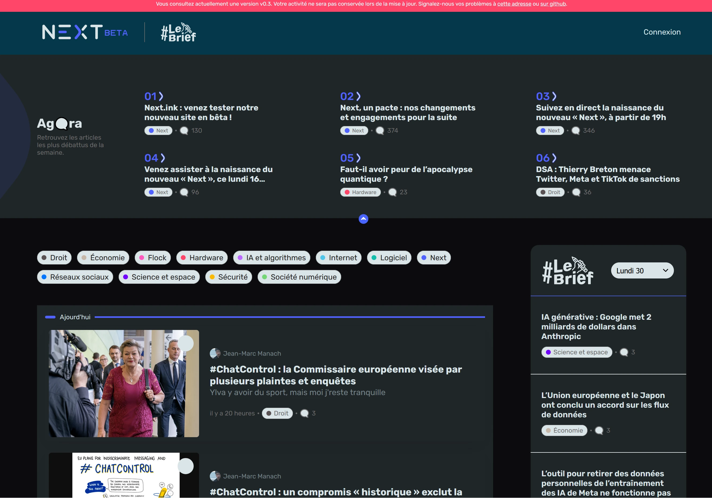
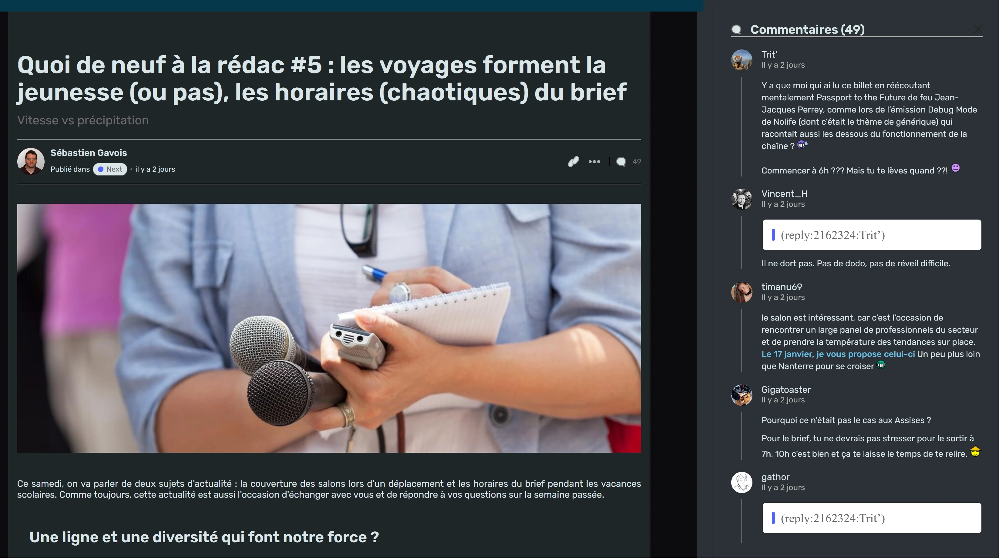

# Personnalisation du thème pour la bêta de Next INpact

Beaucoup le demandais, le voici sous forme d'une extension ! 

Les personnalisations possibles sont cochées, les autres sont prévues dans les jours qui viennent (et si j'en ai le courage) :
- [x] l'activation / désactivation du mode sombre
- [x] l'activation / désactivation de la justification
- [x] l'activation / désactivation de la gestion de la césure lors la justification est activée
- [x] changement de police (mode avec / sans Sérif)
- [x] gestion des écrans larges
- [x] changement de la taille de la police (15px comme sur l'ancien site)
- [x] le retour de Travolta
- [x] condensation de l'Agora
- [x] condensation de la liste des articles
  
Il pourrait y en avoir d'autres. Mais pour l'instant, c'est la feuille de route.

# Screenshots

Quelques captures d'écran :

## Page d'accueil

## Visualisation d'un article

## Liste des commentaires

# Installation
## Via le store
Vous pouvez installer les applications en passant par les stores :
- Chrome : https://chrome.google.com/webstore/detail/prev-inpact/bbodaagihddcjoiomghmcfllkppkcjoj (attention, il faut utiliser le lien car l'extension n'apparait pas volontaire dans les résultats de recherche)
- Firefox : en attente de publication

## Manuellement 
### Sous Firefox
Les informations sont disponibles ici : https://developer.mozilla.org/en-US/docs/Mozilla/Add-ons/WebExtensions/Your_first_WebExtension#installing

Rapidement :
- ouvrir l'url "about:debugging"
- cliquer sur "Ce firefox"
- cliquer sur "Charger une extension temporaire"
- Sélectionner le fichier "manifest.json"
- Visiter la page https://beta.next.ink

N'oubliez pas d'activer l'extension !

### Sous Chrome

Les informations sont disponibles ici : https://developer.chrome.com/docs/extensions/mv3/getstarted/development-basics/#load-unpacked

Rapidement :
- ouvrir l'url "chrome://extensions"
- activer le mode développeur
- cliquer sur "Charger l'extension non empaquetée"
- sélectionner le répertoire où se trouve l'extension

Et voilà !
