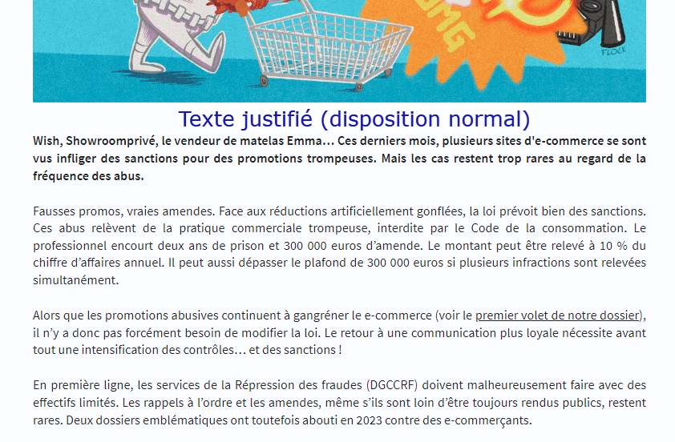

# Alignement du texte

Il est possible de choisir entre 3 alignements de texte différents :
- justifié (valeur par défaut sur le site de Next)
- justifié avec césure
- aligné à gauche

Vous pouvez voir les différents rendus dans la capture d'écran ci-dessous :
